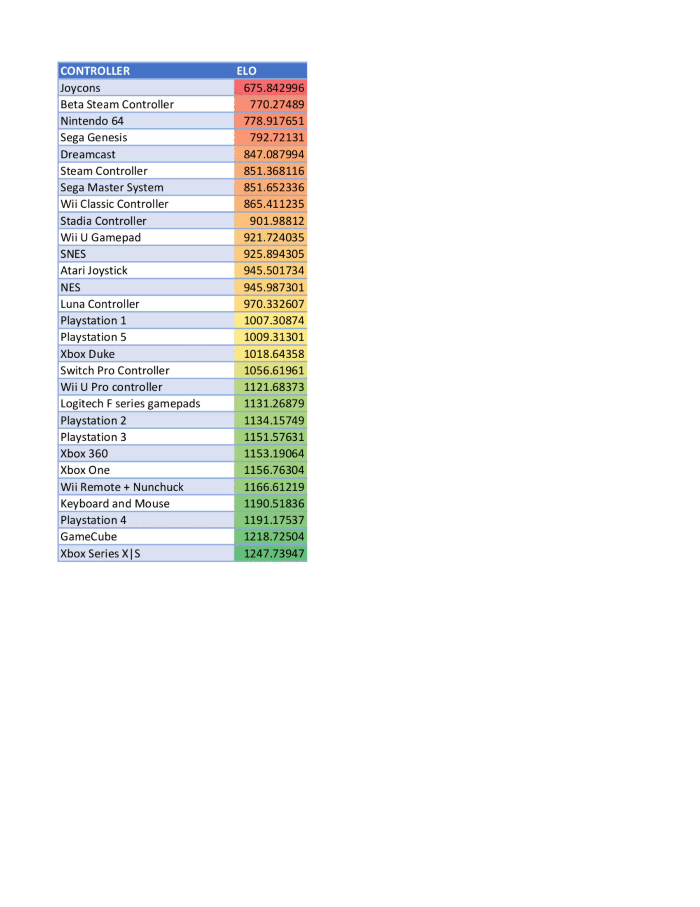

Back in March, the wolfrats, vermin that they are, were arguing over which game controllers
are worst. The general feeling was that the steam controller is bad, the game gamecube controller
is pretty good, and the Playstation controllers are all right too.

Well, we decided to quantify how good we truly feel each controller is, by pitting them against
each other in mortal combat. We'd each repeatedly receive a pair of controllers to compare,
and could choose which was better, mark it as a tie, or skip that particular showdown. The ELO
of each controller would be tracked, and at the end we'd have our definitive rankings of the controllers.

Now, I realized I can kind of fudge the numbers a lot - there are only 4 of us, and we didn't
all respond the same number of times. So I could choose how to scale the effects each voter had on the result,
by either randomly sampling votes from the four of us in equal quantities, or by having people who voted fewer times
have their votes randomly duplicated or just weighted more. I did none of that. Additionally, deciding
how much each vote could affect a change in ELO was another parameter that could swing the result one way
or the other. I settled on 40 ELO points being the "k-factor", for no particular reason at all.

Thus, without further ado, this is the definitive list of game controllers from worst to best. There
will be no more arguing or discussion of the topic, sans some opinions of the voters listed after the results.
The image is a link to a pdf containing the results as text, because I hate tables displayed as images.

The Joycons are the worst - they break easily, they're not comfortable, and their bluetooth range sucks. At least they shake well.
The N64 controller has been discussed to death already, and nostalgia could not save it here. SEGA didn't live long enough to design a good
controller, and neither iteration of the Steam Controller is remotely usable. Somehow the Atari joystick clawed its way up - this seems
to be the works of the Mighty Hoag, as before He voted it was sixth to last. The GameCube controller lived up to the hype, and was nearly
crowned the king despite being behind the PS4 controller and keyboard in mouse in the early voting. But ultimately, it was the
all-around decent controller that only one of us actually ever used that took the W home to the worst named console of all time, the Series S and X.

