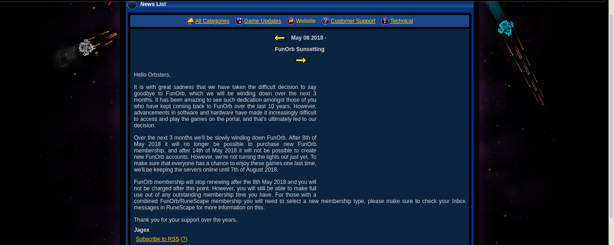
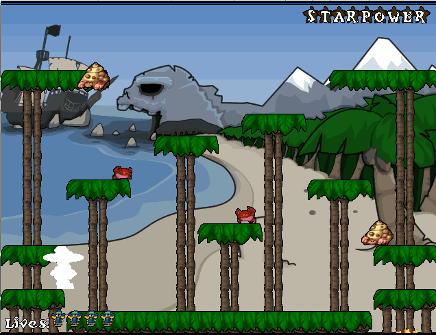
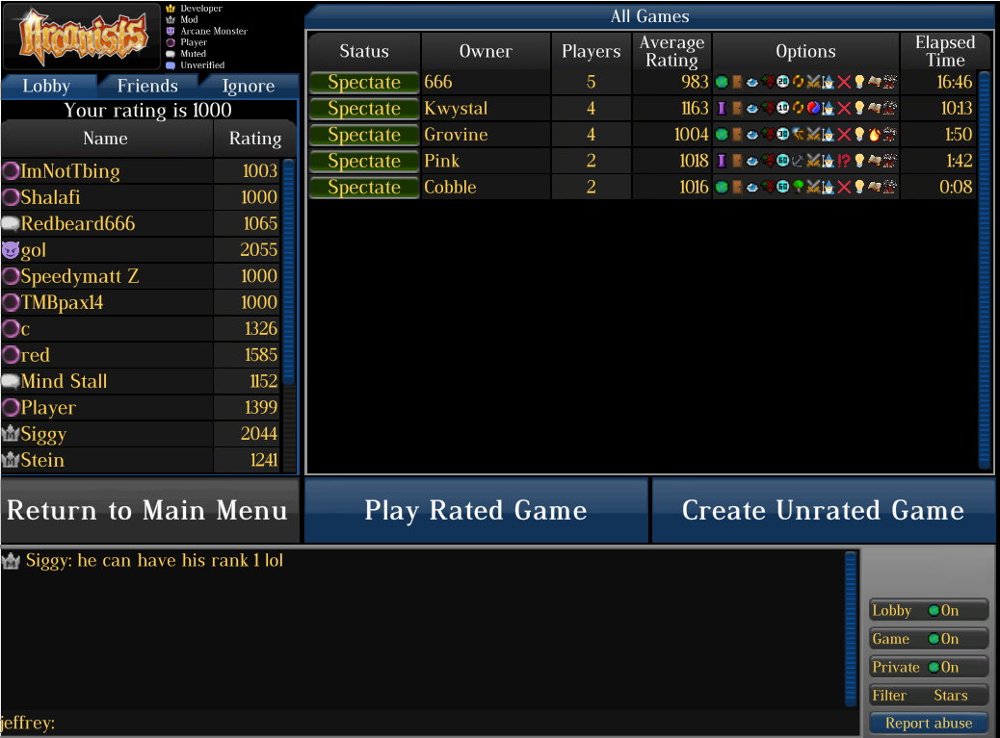

# A trip through time

The year is 2008. You've spent the last 200 hours cutting Yew logs in RuneScape to save up for a Dragon Axe, while paying $5/mo in membership fees.
Then, on February 27th, from the creators of RuneScape comes a new gaming website: FunOrb. For a mere $3/mo, you get access to dozens of games, including
the site's crown jewel, Arcanists, a turn based artillery game comparable to the Worms series. For three years the game reigned as the site's most popular,
and arguably most fun, game. The community grew, the forums were active, and the devs were responsive and even engaged in community events regulary.

But something changed. All of the upcoming games, which were very ambitious and really had you excited, are cancelled.
There's a bug in Arcanists that allow players to take each other's turns, but the devs aren't doing anything. They removed the ability to
chat with RuneScape players from FunOrb games rather than fix a bug with the FunOrb private message system.
Over the years the playerbase dwindled. You start having to use obscure tricks to even get the games to run - after all, they're Java applets, which aren't
safe for the new world. One day in 2014 you see that a game has unceremoniously been added to the website. Briefly, you feel hopeful. But another
four years pass.

And you finally see a new news post on the funorb home page! But it's your worst fear.

It is now 2021. The Dragon Axe was renamed to the Dragon Hatchet 12 years ago. RuneScape now charges 🦀$11🦀. You find yourself playing Old School RuneScape,
the 2007 backup of the beloved online adventure game. But after a year, something feels off.

# Funorb Launchers

You realize that you _should_ be playing Arcanists. So you poke around the internet, and eventually you find that the subreddit has the resources you want - 
[funorb launchers](https://www.reddit.com/r/funorb/wiki/launchers). Your hope is dashed quickly, however, when you read that they're single-player only.
But that doesn't stop you from marching onward, at least you have some of your cherished memories back!
You download the alterorb launcher first, and play through the library of single player games. You start with your favorites - maybe its Zombie Dawn, the
puzzle game where you control a horde of zombies. After invading the local mall, you're content - everything is as you remember it.

You continue your journey through the catalog. Maybe you play some Wizard Run, a platform shooter in which you shoot stars at helpless creatures. It holds up,
and is a perfectly fine use of your time. Star Cannon was another good one, but it's graphics feel a little dated to you now. Ace of Skies is fun, but it's
hardly more than an old flash game. You begin to feel disappointed, but you remain hopeful that the multiplayer games, even single player only, still spark joy.

You download the Kosmos "Funorb Launcher" next. You are pleasantly surprised at what you find. The brick-breaker game Brick-A-Brac is half decent. The
entire single player mode of Steel Sentinels is there, and you can even goof off with customized mechs. But after a few minutes of testing spells in
the Arcanist's sandbox, what was lost starts to hit you. Armies of Gielinor, the RuneScape strategy game, doesn't even have its sandbox multiplayer working.
Deko Block is missing entirely, among many others. Void Hunters is present, but doesn't load.

# A New Hope

A creeping loneliness sets in. Even the single player games relied on a community - they had weekly high scores, forums, and site-wide achievements.
Being in the top 10 on the high scores for three different games in the same week was your peak, after all. But while these launchers let you play
the games, they don't let you relive the experiences. At least, not for very long.

But there is one more hope. You find a [https://arcanists.online/](sketchy link) mentioned on the Funorb discord. It claims to have a download
for a unity remake of Arcanists, even including an android APK. You click download, fully expecting it to steal your identity and your credit cards, make
the paint peel off your walls, and translate the rest of this blog post into swahili. But instead, it opens up a login page. You register an account, login, and:

There are dozens of us. _Dozens_. You can even find games fairly quickly, and all of the old spells are there - plus some new ones. You can, of course, play
with only the spells you remember - they all feel like they always did. You have finally found everything that was missing. That is, until these servers
are inevitably shut down, and you are once again left heartbroken.
